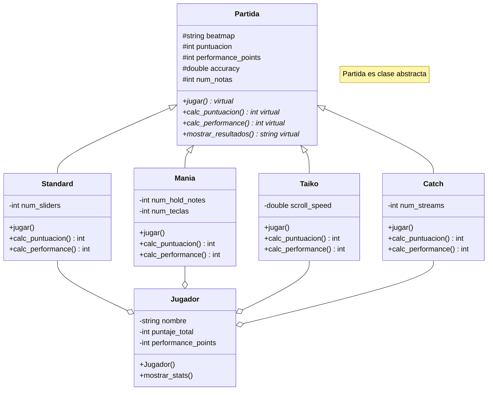

# Simulador de osu! 
## Contexto
[osu!](https://osu.ppy.sh/) es un juego de ritmo inspirado en el juego [Osu! Tatakae! Ouendan](https://en.wikipedia.org/wiki/Osu!_Tatakae!_Ouendan) para la Nintendo DS. En sus inicios osu! se limitó a emular a este juego. Con el tiempo, pasó a incluir diferentes modos de juego: osu!taiko basado en [Taiko no Tatsujin](https://es.wikipedia.org/wiki/Taiko_no_Tatsujin), osu!catch y osu!mania (similar a Piano Tiles).

Cada uno de los modos de juego cuenta con diferentes mecánicas, las cuales hacen que sea necesario procesar las partidas de forma diferente para obtener la puntuación y los [puntos de rendimiento](https://osu.ppy.sh/wiki/es/Performance_points).

## Funcionalidad
Este programa busca hacer una implementación del sistema de partidas utilizando POO para reutilizar el código que se comparte entre todos los modos de juego y usar polimorfismo para calcular los resultados de una partida.

El programa permite simular una partida jugada para ver su puntuación y puntos de rendimiento correspondientes.

También permite calcular los puntos de rendimiento totales de un jugador en base a sus partidas.

