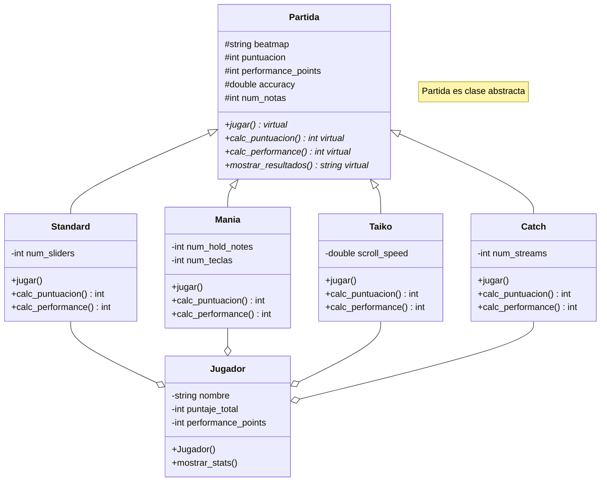

# Proyecto TC1030

```mermaid
classDiagram
    note "Partida es clase abstracta"
class Partida {
    #string beatmap
    #int puntuacion
    #int performance_points
    #double accuracy
    #int num_notas

    +jugar()* virtual
    +calc_puntuacion()* int virtual
    +calc_performance()* int virtual
    +mostrar_resultados()* string virtual
}

class Standard {
    -int num_sliders
    +jugar()
    +calc_puntuacion() int
    +calc_performance() int
}

class Mania {
    -int num_hold_notes
    -int num_teclas
    +jugar()
    +calc_puntuacion() int
    +calc_performance() int

}

class Taiko {
    -double scroll_speed
    +jugar()
    +calc_puntuacion() int
    +calc_performance() int
}

class Catch {
    -int num_streams
    +jugar()
    +calc_puntuacion() int
    +calc_performance() int
}
Partida <|-- Standard
Partida <|-- Mania
Partida <|-- Taiko
Partida <|-- Catch

class Jugador {
    -string nombre
    -int puntaje_total
    -int performance_points
    
    +Jugador()
    +mostrar_stats()
}


Standard --o Jugador
Mania --o Jugador
Taiko --o Jugador
Catch --o Jugador

```
